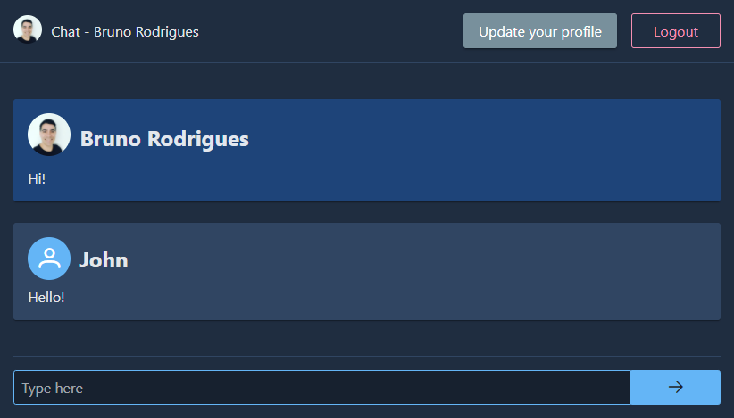

# Chat app - Angular / Serverless

Chat app example using Angular and AWS serverless infrastructure.

##  Project Setup
- Install serverless framework - `npm install serverless -g` or [click here for detailed steps](https://www.serverless.com/framework/docs/getting-started)
- Clone the Project - `https://github.com/bytebruno/chat-app-angular-serverless.git`

## Backend 
- Access the backend folder - `cd backend`
- Install the dependencies - `npm install`

### Running locally
- Install local dynamodb environment - `sls dynamodb install`
- Start local serverless environment - `npm run offline` or `sls offline start`
- The serverless environment will be running at: 
	- **ApiGateway RestApi**:  `http://localhost:15001`
	- **ApiGateway Websocket**: `ws://localhost:3001`
	- **DynamoDB**: `http://localhost:15002` and `http://localhost:15002/shell (visual client)`
	- **S3 bucket**: `http://localhost:4569 `
	
### Running on AWS
- Change the **bucket name** on `serverless.ts` at line 62 otherwise the deploy will fail due to S3's name duplication. 
- Deploy to AWS- `npm run deploy` or `sls deploy` 

## Frontend
- Access the client folder - `cd client`
- Install the dependencies - `npm install`

### Running locally
- Change **apiUrl** and **websocketUrl** environment variables at `src/environments/environment.ts` **to match your local or deployed serverless api urls**.
- Start local angular app  - `npm start`
- Your local client will be running at `http://localhost:4200`
- Extra: You can test with more users loging in different browsers.

## Testing on Postman
#### See here [README-TEST-POSTMAN](https://github.com/bytebruno/chat-app-angular-serverless/blob/master/docs/tests/README-TEST-POSTMAN.md)

## Technologies

- AWS Serverless Infrasctructure
- Serverless Framework
- Angular 12
- PrimeNg

## What was I going to do next?

- Add more logs;
- Show an event on chat when users connects or disconnects;
- Handle websocket disconnection;
- Unit tests;
- Implement some state management on client, possibly NGRX;