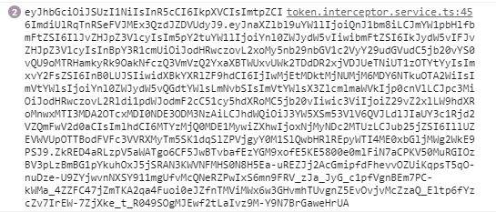
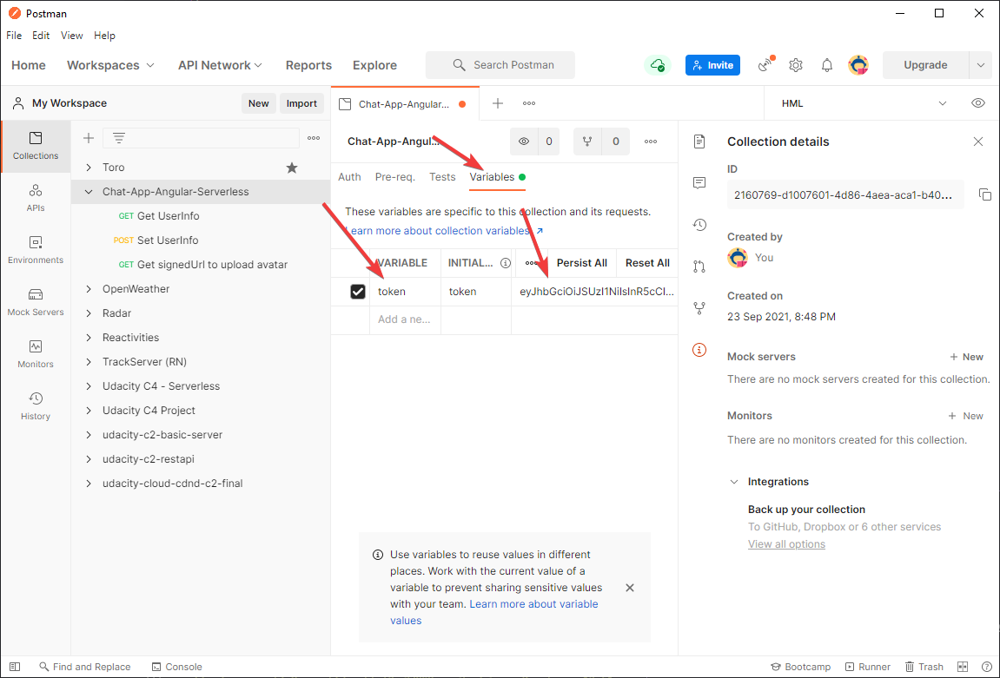
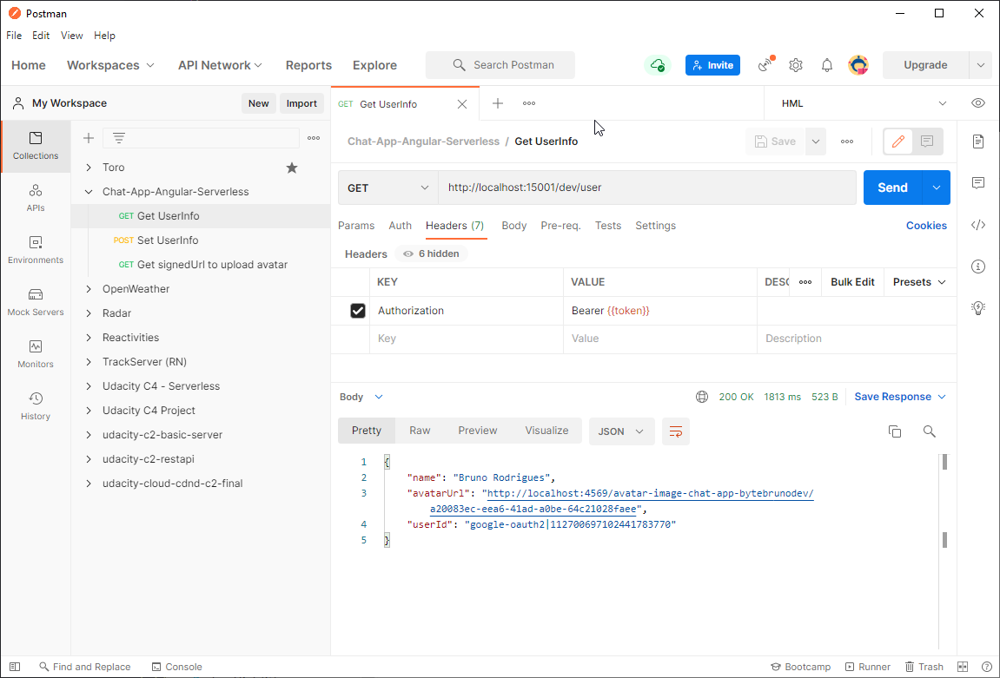
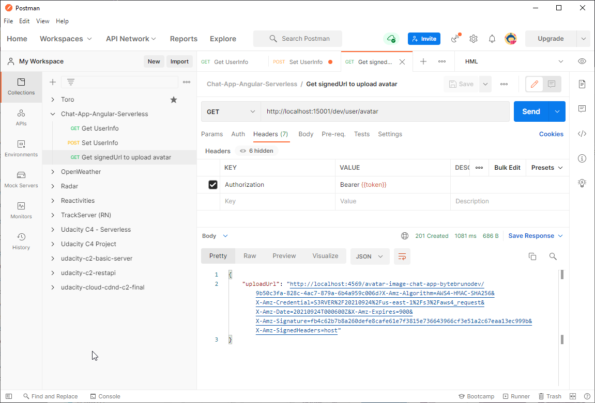
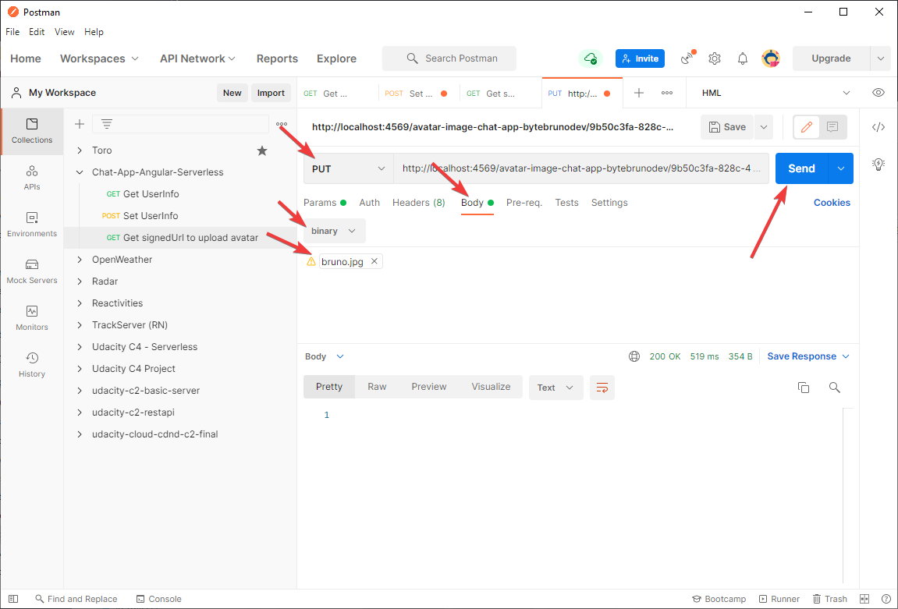

# Chat app - Angular / Serverless - Testing on Postman

## Postman setup

 - Import **Chat-App.postman_collection.json** at `docs/tests` on Postman
 - On browser development tools, **COPY** the token that is printed in the console after you log in.
 - Token image example:
	  
- Paste your jwt token in the value field of **token** variable on your recently imported collection.
-  Collection variables image example:
	  

## Postman Requests
- Get UserInfo request:
	 
- Set UserInfo:
	 
- Get SignedUrl for avatar upload:
	 
	- Click on uploadUrl generated response:
		- Change Http method to **Put**
		-  Select **binary** on Body params
		-  Click on select file and choose an image
		-  Click on Send to upload to S3
		 